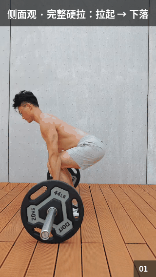
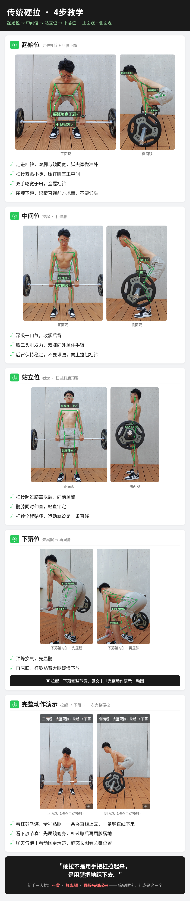

# deadlift-teaching · 硬拉教学 Skill

给 AI 健身助手用的硬拉教学内容生成与分发 skill。用户对助手说"**教我做硬拉**"，助手直接返回成品三件套，零计算：

1. **正面观完整硬拉动图**（地面 → 拉起 → 锁定 → 下落回地面，一次完整 rep）
2. **侧面观完整硬拉动图**
3. **四步教学长图**（①起始位 ②中间位 ③站立位 ④下落位 ⑤完整动作演示 + 新手三大坑）

## 成品预览





## 生成管线

| 脚本 | 作用 |
|---|---|
| `scripts/annotate_pose.py` | 教学照片 → MediaPipe 姿态关键点 → 骨架连线 + 动作要点标签。文件名即元数据：`01_start_front.jpg`（位置\_视角） |
| `scripts/scan_video.py` | 视频 → 膝角/髋角/杠高（腕高）曲线。粗扫 0.5s 看结构，细扫 0.25s 定起止，**起止以曲线为准**（视觉模型会臆造细节） |
| `scripts/make_fullrep_gifs.py` | 从视频挑一次最干净的完整硬拉 → GIF。横幅字号自适应防裁切、相邻帧去重、单条 ≤3.5MB |
| `templates/tutorial.html` | 四步长图模板，`chromium-browser --headless --screenshot` 渲染成 PNG |

选段方法论、踩坑记录见 [`references/fullrep-gif-pipeline.md`](references/fullrep-gif-pipeline.md)。

## 依赖

- Python 3.10+：`mediapipe` `opencv-python` `numpy` `Pillow`
- `chromium-browser`（渲染长图）
- MediaPipe 模型 `pose_landmarker_full.task` 已内置（`scripts/`）

## 目录结构

```
├── SKILL.md                  # Hermes Agent skill 定义（触发词/输出契约/红线）
├── assets/                   # 成品三件套 + 8 张步骤标注照
├── references/               # 管线完整记录与踩坑
├── scripts/                  # 标注/扫描/GIF 生成脚本 + 姿态模型
└── templates/                # 长图 HTML 模板（相对路径引用 ../assets/）
```

## 说明

- SKILL.md 是 [Hermes Agent](https://github.com/nousresearch/hermes-agent) 的 skill 格式，思路可迁移到其他助手框架
- 演示者为本 skill 作者本人，素材请勿冒用
- License: [MIT](LICENSE)
